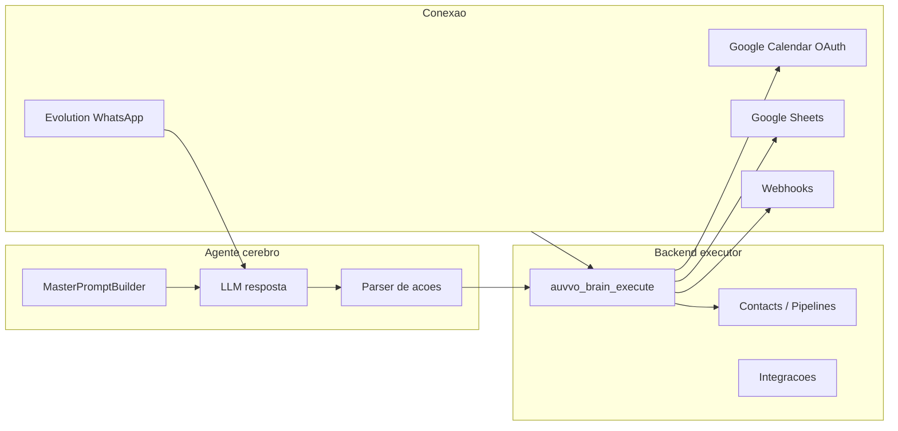

# Arquitetura Auvvo — Conexão → Agentes → Automação (cérebro primeiro)

## Visão

O produto tem três camadas para o usuário:

| Camada | O que o usuário configura | O que executa de fato |
|--------|---------------------------|------------------------|
| **Conexão** | WhatsApp (Evolution), OAuth Google, webhooks | Backend + tokens por `user_id` |
| **Agentes** | Personalidade, objetivo, FAQ, integrações ligadas | **Cérebro (LLM)** lê instruções e decide ações |
| **Automação** | Quando reagir (gatilho) + missão/regras | Cérebro + fila; fluxo visual = camada opcional |

**Princípio:** a IA não “finge” integrar — ela **entende** o pedido (prompt + contexto) e o **backend** executa (calendário, CRM, Sheets, HTTP). O nó “Ação” no editor visual serve para casos determinísticos e power users, não como centro do produto.

---

## O que já existe (parcial)

- **Google Calendar:** `MasterPromptBuilder` ensina `[[GCAL_EVENT]]`; `extractGcalDirective()` + `GoogleCalendar::createEvent()` em `ai_reply.inc.php` / `webhook_ai_pipeline.inc.php`.
- **CRM / integrações no fluxo visual:** `auvvo_crm_execute_action()` (tags, estágio, WhatsApp, Sheets, HTTP preset, etc.) — disparado por **regras/grafo**, não pelo cérebro em conversa.
- **tool_calls nativos:** quando a API devolve só `tool_calls`, o cérebro converte e executa (sem retry cego). Texto de confirmação automático se a IA não enviar mensagem.

---

## Modelo alvo: Registro de ferramentas + executor



### 1. Catálogo de ferramentas (`auvvo_brain_tools.inc.php`)

Cada ferramenta declara:

- `id` (ex.: `calendar.create_event`, `crm.add_tag`, `crm.move_stage`, `sheets.append_row`, `http.preset`)
- `requires` — integração conectada? (ex.: calendar token)
- `prompt_block` — texto injetado no prompt **só se** disponível
- `schema` — JSON esperado na ação
- `execute(PDO, userId, agent, contact, payload)` — chama código existente (`auvvo_crm_execute_action`, `GoogleCalendar`, etc.)

### 2. Formato de ação (evolução de `[[GCAL_EVENT]]`)

Padronizar um bloco no **final** da resposta (invisível ao cliente), parseável e extensível:

```text
[[AUVO_ACTIONS]]
[
  {"tool":"calendar.create_event","payload":{"start":"...","end":"...","summary":"..."}},
  {"tool":"crm.add_tag","payload":{"tag":"agendado"}},
  {"tool":"crm.move_stage","payload":{"stage":"qualified"}}
]
```

- Compatibilidade: manter suporte a `[[GCAL_EVENT]]` legado.
- Uma função `auvvo_brain_parse_actions($text)` retorna `clean_text` + lista de ações.
- `auvvo_brain_run_actions()` executa em ordem, loga erros, hidrata contato após CRM.

Alternativa futura: OpenAI `tools` + loop tool/result (substituir retry `tool_choice: none`).

### 3. Prompt do agente

`MasterPromptBuilder` passa a montar seção **FERRAMENTAS DISPONÍVEIS** dinamicamente:

- Só lista o que está **habilitado e conectado** para aquele `user_id`.
- Explica **quando** usar cada uma (ex.: só agendar após confirmação explícita de data/hora).
- Referencia o formato `[[AUVO_ACTIONS]]` (e legado GCAL).

Instruções do usuário (`type_config`, `prompt_base`, FAQ) continuam sendo a “personalidade”; ferramentas são **capacidades**.

### 4. Automação (nova semântica)

| Tipo | Papel |
|------|--------|
| **Gatilho** | `whatsapp_first`, `stage_enter`, `webhook_received`, `ltv_inactive`, etc. |
| **Missão para o cérebro** | Texto injetado na próxima resposta ou turno dedicado (“lead entrou em Proposta: confirme briefing e proponha call”) |
| **Fluxo visual** | Opcional: condições duras, delays, A/B; ações fixas sem LLM |
| **Regra básica** | Atalho: gatilho + mensagem fixa OU “delegar ao agente X com missão Y” |

Evitar templates que dependem só de `keyword_contains` em `whatsapp_message` — preferir `whatsapp_first` + memória + cérebro, ou `stage_enter` / `tag_added`.

### 5. Templates / pacotes (conteúdo, não motor)

Templates deixam de ser “grafos frágeis” e passam a ser **playbooks**:

- Bloco de instruções para colar no agente (objetivo, roteiro, quando usar calendário/CRM).
- Gatilho sugerido (primeira mensagem, estágio).
- Fluxo visual **opcional** só para delays e mensagens fixas legais.

---

## Fases de implementação

### Fase 1 — Executor unificado (fundação) ✅ implementado

- `auvvo_brain_tools.inc.php` — parse `[[AUVO_ACTIONS]]` + legado `[[GCAL_EVENT]]`.
- Ferramentas: `calendar.create_event`, `crm.*`, `sheets.append_row`, `webhook.outbound`, `http.preset`.
- `MasterPromptBuilder` injeta lista dinâmica (IDs de webhooks e presets HTTP da conta).
- `ai_reply.inc.php` e `webhook_ai_pipeline.inc.php` chamam `auvvo_brain_process_llm_response()`.

### Fase 2 — Prompt dinâmico

- `MasterPromptBuilder`: seção ferramentas conforme `auvvo_integration_status` + flags do agente.
- Documentar em agentes.php: “o que o cérebro pode fazer” espelhando integrações conectadas.

### Fase 3 — Automação alinhada

- Novo tipo de ação de regra/fluxo: `brain_mission` (texto + agent_id opcional).
- Gatilhos disparam missão + contexto em `memory_json` ou fila curta.
- UI automacoes.php: copy “O agente decide como executar; backend aplica integrações”.

### Fase 4 — Templates / pacotes (playbooks)

- Reescrever `automacoes-flow-templates.js` e `auvvo-pack-flows.js` como playbooks + fluxos mínimos.
- Pacotes AuvvoPackTemplates: highlights citando calendário, primeira mensagem, handoff por cérebro.

### Fase 5 — Tools nativas LLM (opcional)

- Opcional: `BRAIN_NATIVE_TOOLS=1` no `.env` envia `tools` no payload OpenAI/OpenRouter (além de `[[AUVO_ACTIONS]]`).
- Fila: worker Node grava `storage/worker_heartbeat.txt` a cada tick; painel Automações mostra atrasos e worker inativo.
- Dedupe global: `whatsapp_first`, `stage_enter:{slug}`, `tag_added:{tag}` — painel lista conflitos entre regras/fluxos ativos.
- Log: tabela `brain_action_log`; conversas mostram últimas ações executadas pelo cérebro.

---

## O que NÃO fazer

- Duplicar integrações no frontend; sempre `auvvo_crm_execute_action` / classes `Google*`.
- Templates longos só com `whatsapp_message` + palavra-chave como única lógica.
- Prometer calendário nos templates sem checar OAuth (prompt já trata; manter).

---

## Arquivos principais a tocar

| Arquivo | Mudança |
|---------|---------|
| `backend/auvvo_brain_tools.inc.php` | **Novo** — registry + executor |
| `backend/MasterPromptBuilder.php` | Ferramentas dinâmicas + `[[AUVO_ACTIONS]]` |
| `backend/ai_reply.inc.php` | Parser/executor unificado |
| `backend/webhook_ai_pipeline.inc.php` | Idem |
| `backend/crm_automation.inc.php` | Reuso em `execute()` das tools |
| `backend/BPM-FLUXO-MOTOR.md` | Camada “cérebro” documentada |
| `agentes.php` | UI capacidades do cérebro |
| `automacoes.php` | Copy + missão cérebro |
| `assets/automacoes-flow-templates.js` | Playbooks (fase 4) |

---

## Critérios de sucesso

1. Cliente confirma horário no WhatsApp → evento no Google Calendar **sem** nó manual no fluxo.
2. Agente instruído a “marcar como qualificado” → tag/estágio via cérebro + backend.
3. Integração desligada → prompt não oferece ferramenta; IA não inventa execução.
4. Fluxo visual continua funcionando para quem quer automação 100% determinística.
